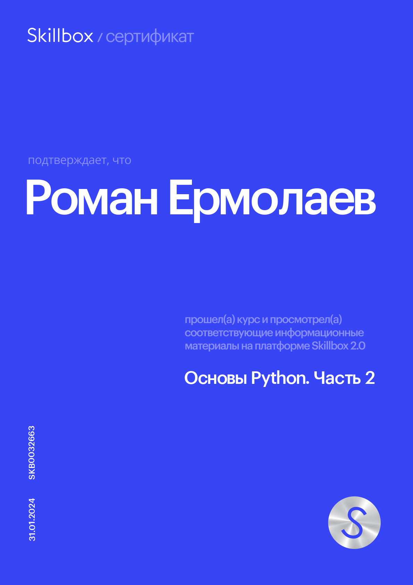

***

 

# Roman Ermolaev diploma

## What does the bot do?

***

+ **находит отели по всему миру**
+ **показывает фотографии отелей**
+ **определяет расположение отелей**
+ **гибкая система поиска отелей**
+ **сохраняет историю поиска пользователя в базу**

### [Test the bot](https://t.me/python_basic_final_bot "Go to Telegram")

## Commands

***

+ /help

> *показать команды бота*

+ /lowprice

> *Запрашивает город, дату заезда/выезда и находит отели в городе от самых дешёвых к более дорогим

+ /highprice

> *Запрашивает город, дату заезда/выезда и находит отели в городе от самых дорогих в более дешёвым

+ /bestdeal

> *Запрашивает город, дату заезда/выезда, минималььное и максимальное расстояние от центра и находит отели в городе

+ /history

> *выводи историю поиска пользователя  

## Requirements

***

+ certifi==2023.11.17
+ charset-normalizer==3.3.2
+ idna==3.6
+ jsonpickle==3.0.2
+ peewee==3.17.0
+ pyTelegramBotAPI==4.15.3
+ python-dateutil==2.8.2
+ python-dotenv==1.0.1
+ python-telegram-bot-calendar==1.0.5
+ requests==2.31.0
+ six==1.16.0
+ telebot==0.0.5
+ urllib3==2.1.0

## Preparation and Launch

***

Create a file.env in the program directory and fill it in according to .env.template

> *In the environment variables RAPID_API_KEY and ANOTHER_RAPID_API_KEY, two different keys should be specified for operation with the Hotels API (Or leave only RAPID_API_KEY, if you are sure that 500 requests per month will be enough).  
The REQUESTS_LIMIT_REACHED parameter is "False" by default, there is no need to change it.  
These parameters are created to change the API key when the request limit is used up*

*** Teacher responce

Сильные стороны вашего проекта:  
+ Архитектура, которую в дальнейшем вы можете переиспользовать для своих нужд;
+ Работа с базой данных - умение писать даже простые SQL запросы, непременно пригодится вам в будущем;
+ Работа с API;
+ Работа с переменными окружения. Хоть это и кажется маленькой частичкой целого, но без переменных окружения не обходится ни один проект, а это еще один навык в вашу копилку знаний.

 